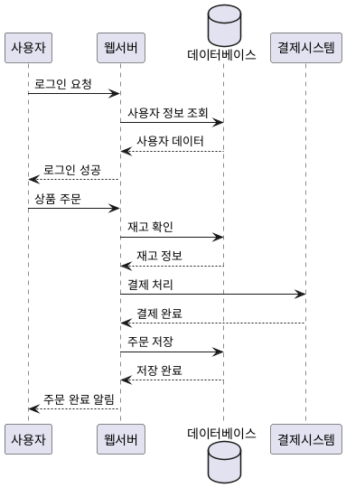

# 🎯 Interactive Animated PlantUML

웹에서 PlantUML 텍스트를 입력하여 상호작용 가능한 애니메이션 다이어그램을 생성하는 시스템입니다.

   

## ✨ 주요 기능


### 🎨 인터랙티브 기능
- **드래그 앤 드롭**: 모든 객체를 자유롭게 이동 가능
- **객체 클릭**: 특정 객체 클릭 시 해당 객체부터 흐름 애니메이션 시작
- **실시간 연결선 업데이트**: 객체 이동 시 화살표와 연결선 자동 업데이트

### 🎬 애니메이션 시스템
- **흐름 시각화**: 화살표를 따라 연결된 노드들이 순차적으로 하이라이트
- **점진적 강조**: 테두리 두껍게, 색상 변화 등 시각적 피드백
- **애니메이션 속도 조절**: 0.5x ~ 3.0x 속도 조절 가능
- **리플 효과**: 객체 클릭 시 파급 효과 애니메이션

### 📝 PlantUML 지원
- **시퀀스 다이어그램**: 참여자 간의 메시지 흐름
- **다양한 객체 타입**: actor, participant, entity, database, boundary, control, collections, queue
- **확장된 화살표 스타일**: 실선(`->`), 점선(`-->`), 굵은선(`->>`), 양방향, 특수 연결선
- **라벨링**: 연결선에 설명 텍스트 추가
- **그룹화**: 섹션별 구분 및 정리
- **노트**: 추가 설명 및 주석 지원

### 🎛️ 고급 컨트롤
- **샘플 선택기**: 4가지 사전 정의된 샘플 다이어그램
- **애니메이션 속도 조절**: 0.5x ~ 3.0x 실시간 속도 변경
- **라벨 표시/숨김**: 연결선 라벨 토글 기능
- **자동 애니메이션**: 다이어그램 생성 시 자동 애니메이션 실행
- **효과음**: 애니메이션 효과음 지원 (개발 중)

## 🚀 사용 방법

### 기본 사용법
1. **PlantUML 텍스트 입력**: 좌측 텍스트 영역에 PlantUML 코드 작성
2. **다이어그램 생성**: "📊 다이어그램 생성" 버튼 클릭
3. **객체 조작**: 생성된 객체를 드래그하여 위치 조정
4. **흐름 애니메이션**: 특정 객체 클릭 또는 "▶️ 흐름 애니메이션" 버튼으로 전체 애니메이션 실행

### 키보드 단축키

**기본 조작**:
- `Ctrl/Cmd + Enter`: 다이어그램 생성
- `Ctrl/Cmd + Space` 또는 `Space`: 전체 애니메이션 실행
- `Ctrl/Cmd + R`: 다이어그램 리셋
- `Escape`: 애니메이션 중지

**고급 기능**:
- `Ctrl/Cmd + +/-`: 애니메이션 속도 조절
- `Ctrl/Cmd + 1~4`: 샘플 다이어그램 선택
- `Tab`: 객체 간 포커스 이동 (접근성)
- `H` 또는 `?`: 도움말 표시

**접근성 지원**:
- 스크린 리더 호환
- 키보드 전용 네비게이션
- 포커스 표시 및 음성 안내

### 예제 PlantUML 코드



## 🏗️ 시스템 아키텍처

### 컴포넌트 구조

```
AnimatedPlantUMLApp (main.js)
├── PlantUMLParser (plantuml-parser.js)
│   ├── 텍스트 파싱 및 객체 추출
│   ├── 연결 관계 분석
│   └── 자동 레이아웃
├── CanvasEngine (canvas-engine.js)
│   ├── SVG 렌더링
│   ├── 드래그 앤 드롭 처리
│   └── 실시간 업데이트
└── AnimationSystem (animation-system.js)
    ├── 흐름 그래프 구축
    ├── 순차 애니메이션
    └── 시각 효과 관리
```

### 기술 스택
- **Frontend**: HTML5, CSS3, JavaScript (ES6+)
- **Graphics**: SVG (Scalable Vector Graphics)
- **Animation**: CSS Transitions + JavaScript
- **Architecture**: 모듈화된 클래스 기반 설계

## 📋 지원되는 PlantUML 요소

### 객체 타입
- `participant`: 일반 참여자
- `actor`: 액터 (사용자)
- `entity`: 엔티티
- `database`: 데이터베이스
- `boundary`: 경계 객체
- `control`: 제어 객체

### 화살표 타입
- `->`: 실선 화살표
- `-->`: 점선 화살표
- `<-`: 역방향 실선 화살표
- `<--`: 역방향 점선 화살표
- `->>`: 굵은 화살표
- `<<-`: 역방향 굵은 화살표

### 예제 구문

```plantuml
@startuml
# 객체 정의
actor "사용자" as User
participant "시스템" as System
database "DB" as Database

# 연결 및 메시지
User -> System: 요청
System --> Database: 데이터 조회
Database --> System: 결과 반환
System -> User: 응답
@enduml
```

## 🎛️ 고급 기능

### 애니메이션 제어
- **속도 조절**: 슬라이더로 0.5x ~ 3.0x 속도 설정
- **선택적 애니메이션**: 특정 객체 클릭으로 해당 지점부터 시작
- **경로 미리보기**: 객체별 애니메이션 경로 예상 가능
- **분기 처리**: 여러 출력 연결이 있는 경우 병렬 애니메이션

### 시각적 효과
- **하이라이트**: 활성 객체 테두리 강조
- **펄스 효과**: 선택된 객체 깜빡임 효과
- **리플 효과**: 클릭 지점에서 퍼져나가는 원형 효과
- **흐름 표시**: 연결선을 따라 흐르는 대시 애니메이션

## 🔧 커스터마이징

### CSS 변수 수정
- 색상 테마 변경
- 애니메이션 지속 시간 조정
- 객체 크기 및 스타일 수정

### JavaScript 확장
- 새로운 객체 타입 추가
- 사용자 정의 애니메이션 효과
- 추가 PlantUML 구문 지원

## 🌐 브라우저 호환성

- Chrome 80+
- Firefox 75+
- Safari 13+
- Edge 80+

## 📱 반응형 디자인

- 모바일 친화적 인터페이스
- 터치 기반 드래그 앤 드롭
- 화면 크기별 최적화된 레이아웃

## 📚 추가 리소스

- **[examples.md](./examples.md)**: 상세한 PlantUML 예제 모음 및 고급 사용법
- **[GitHub Repository](https://github.com/your-repo/animated-plantuml)**: 소스 코드 및 이슈 트래킹
- **[PlantUML 공식 문서](https://plantuml.com/)**: 전체 PlantUML 문법 가이드

## 🚀 시작하기

1. 모든 파일을 웹 서버에 배포
2. `index.html` 파일 열기
3. 샘플 다이어그램이 자동으로 로드됨
4. PlantUML 텍스트 수정하여 사용자 정의 다이어그램 생성

### 빠른 시작 가이드

1. **샘플 선택**: 드롭다운에서 원하는 샘플 선택
2. **텍스트 편집**: PlantUML 코드 수정
3. **다이어그램 생성**: `Ctrl+Enter` 또는 생성 버튼 클릭
4. **애니메이션 실행**: 객체 클릭 또는 `Space`키로 애니메이션 시작
5. **위치 조정**: 객체를 드래그하여 원하는 위치로 이동

## 🛠️ 개발자 가이드

### 프로젝트 구조

```
animated_plantuml/
├── index.html              # 메인 HTML 파일
├── styles.css              # CSS 스타일시트
├── plantuml-parser.js       # PlantUML 파서
├── canvas-engine.js         # SVG 캔버스 엔진
├── animation-system.js      # 애니메이션 시스템
├── main.js                  # 메인 애플리케이션
├── README.md               # 프로젝트 문서
└── examples.md             # 예제 및 사용법
```

### 확장 가능성

- **새로운 객체 타입 추가**: `plantuml-parser.js`에서 패턴 확장
- **애니메이션 효과 개선**: `animation-system.js`에서 새로운 효과 구현
- **테마 및 스타일**: `styles.css`에서 색상 및 디자인 커스터마이징
- **다국어 지원**: 인터페이스 텍스트 현지화

---

💡 **팁**: 복잡한 다이어그램의 경우 애니메이션 속도를 낮추면 흐름을 더 명확하게 관찰할 수 있습니다.
