# 🎯 Interactive Animated PlantUML - 예제 모음

이 문서는 Interactive Animated PlantUML에서 지원하는 다양한 PlantUML 문법과 기능을 보여주는 예제들을 포함합니다.

## 🚀 기본 사용법

### 1. 간단한 시퀀스 다이어그램

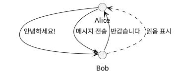

**설명**: 다양한 화살표 스타일을 보여주는 기본적인 예제입니다.

### 2. 참여자 정의가 있는 다이어그램

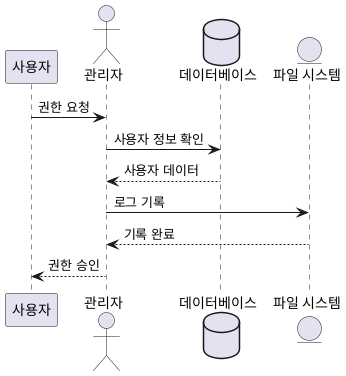

**설명**: 다양한 객체 타입(participant, actor, database, entity)을 사용한 예제입니다.

## 🏢 실무 예제

### 3. 전자상거래 주문 프로세스

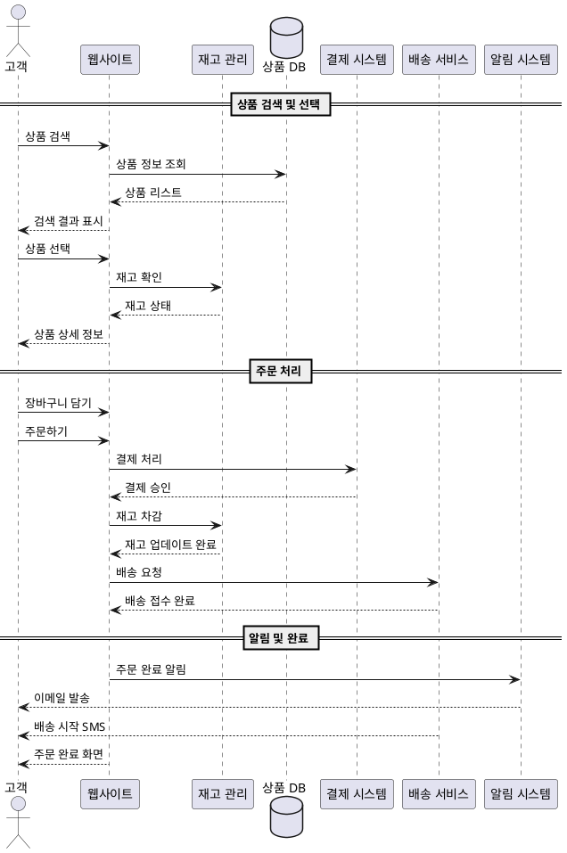

### 4. 마이크로서비스 아키텍처

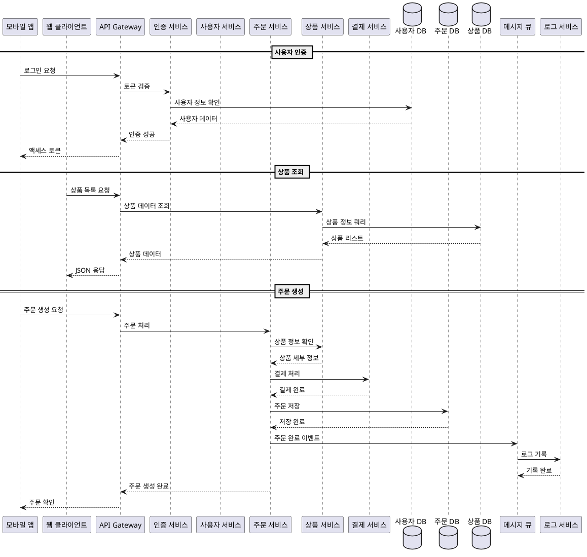

## 🎨 고급 문법 예제

### 5. 다양한 화살표 스타일

```plantuml
@startuml
participant A
participant B
participant C

A -> B: 일반 화살표
A --> B: 점선 화살표
A ->> B: 굵은 화살표
A ..> B: 점선 양방향
A <- B: 역방향 화살표
A <-- B: 점선 역방향
A <<- B: 굵은 역방향

note right of A: 실선 화살표는\n동기 호출을 나타냄

note left of B: 점선 화살표는\n응답을 나타냄

note over C: 굵은 화살표는\n비동기 호출을 나타냄
@enduml
```

### 6. 그룹화와 분할

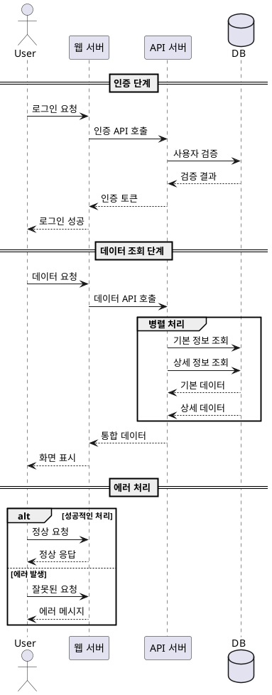

### 7. 생명주기와 활성화

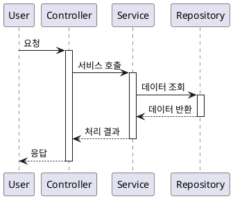

### 8. 컬렉션과 큐

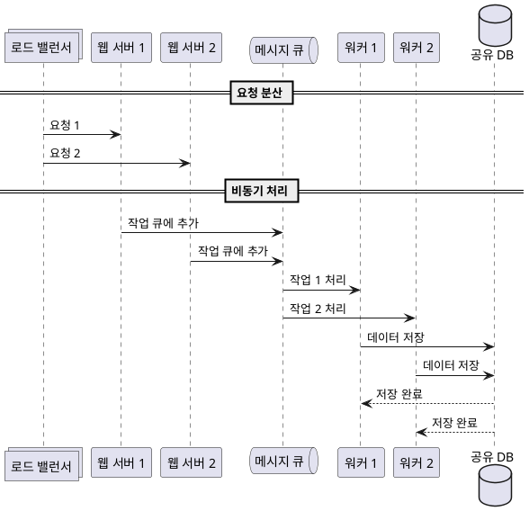

## 🛠️ 특수 기능 예제

### 9. 노트와 주석

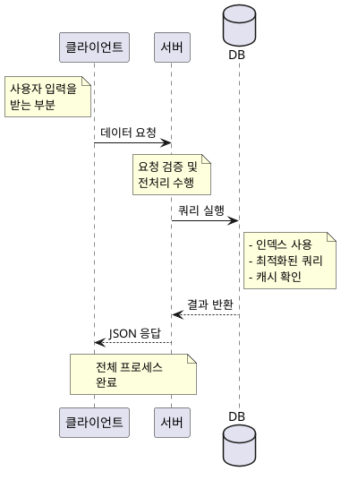

### 10. 조건문과 반복문

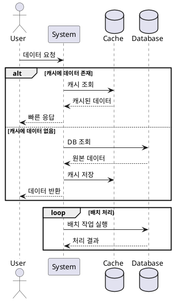

## 🎯 애니메이션 최적화 팁

### 11. 애니메이션 흐름 최적화 예제

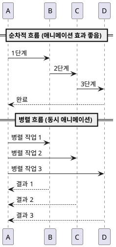

## 📱 모바일 최적화 예제

### 12. 간결한 모바일용 다이어그램

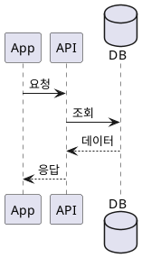

## 🎮 사용법 가이드

### 애니메이션 활용법:

1. **객체 클릭**: 특정 객체를 클릭하면 해당 지점부터 흐름 애니메이션이 시작됩니다.

2. **전체 애니메이션**: "흐름 애니메이션" 버튼을 클릭하면 전체 다이어그램의 흐름이 애니메이션됩니다.

3. **속도 조절**: 슬라이더로 애니메이션 속도를 0.5x ~ 3.0x로 조절할 수 있습니다.

4. **드래그 앤 드롭**: 모든 객체를 자유롭게 드래그하여 위치를 조정할 수 있습니다.

5. **키보드 단축키**: 
   - `Ctrl/Cmd + Enter`: 다이어그램 생성
   - `Ctrl/Cmd + Space`: 애니메이션 실행
   - `Ctrl/Cmd + R`: 리셋
   - `H` 또는 `?`: 도움말 표시

### 최적화된 PlantUML 작성 팁:

- 명확한 객체명 사용
- 적절한 화살표 스타일 선택
- 그룹화와 섹션 활용
- 노트로 추가 설명 제공
- 복잡한 다이어그램은 단계별로 분할

이 예제들을 참고하여 다양한 PlantUML 다이어그램을 생성하고 애니메이션 효과를 즐겨보세요! 🎉